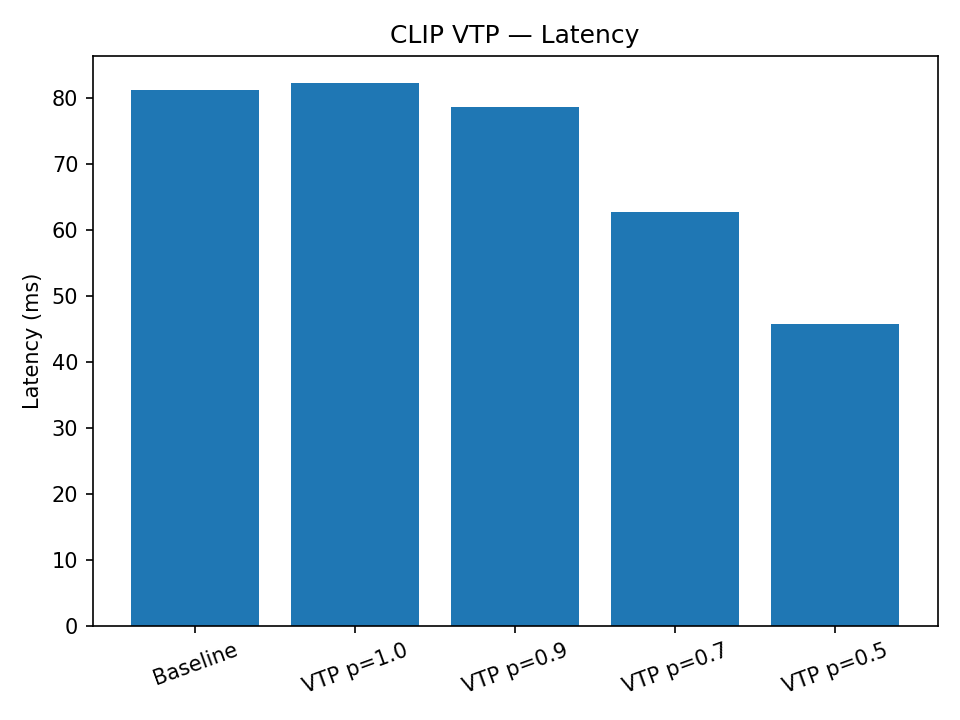
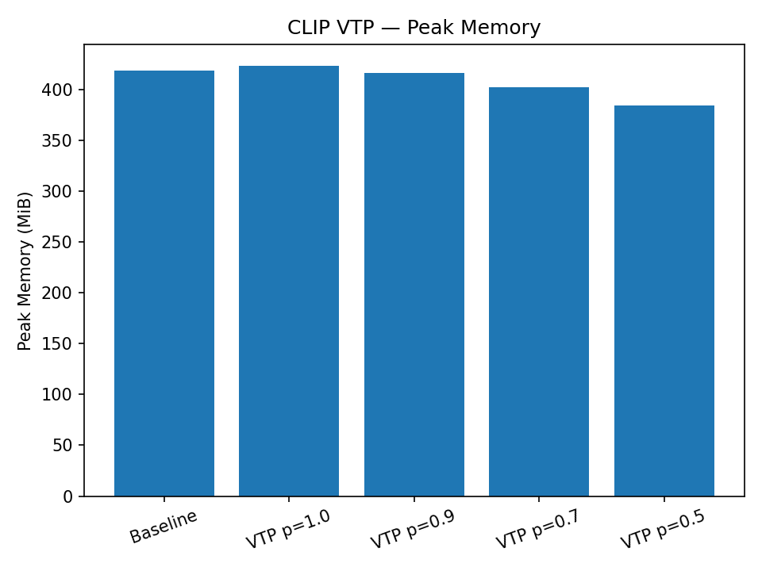

### Efficient Architectures for Sequence and Multimodal Modeling  
**Date:** Nov 2025

---

## Overview
This repository contains all deliverables for **Project A**, which investigates **efficiency-oriented deep-learning architectures** from two complementary perspectives:

| Part | Focus | Model | Core Technique |
|------|--------|--------|----------------|
| **Part A – SSM (Mamba)** | Sequence modeling efficiency | Structured State Space Models (S4 → Mamba) | Linear-time selective scanning |
| **Part B – VLM (CLIP)** | Vision-Language efficiency | CLIP (ViT-B/16) | Vision Token Pruning + Low-Rank Fusion |

Together they show how **architectural efficiency + input-level sparsity** can significantly reduce computational cost while maintaining representational power.

---

## Repository Structure
```

ece1512-projectA/
│
├── ssm/
│   ├── PDF1_SSM_outline.md          # Part A report
│   ├── mrss_proxy_experiment.ipynb  # Colab notebook for Mamba MRSS
│   └── results/                     # charts and logs
│
└── vlm/
├── PDF2_VLM_outline.md          # Part B report
├── VLM_ECE1512.ipynb            # CLIP VTP experiment notebook
└── results/
├── clip_vtp_results.csv
├── clip_vtp_latency.png
├── clip_vtp_memory.png

````

---

## Environment
All experiments were conducted on **Google Colab T4 GPU (16 GB RAM)** using PyTorch 2.x.

```bash
pip install transformers==4.44.2 timm==1.0.9 matplotlib==3.9
````

---

## How to Reproduce

### Part A – Mamba (SSM)

1. Open [`ssm/mrss_proxy_experiment.ipynb`](ssm/mrss_proxy_experiment.ipynb) in Google Colab.
2. Run all cells to profile Selective Scanning and Multi-Resolution SSM extensions.
3. Results will be saved under `ssm/results/`.

### Part B – CLIP (VLM)

1. Open [`vlm/vlm_efficiency_experiment.ipynb`](vlm/vlm_efficiency_experiment.ipynb) in Colab.
2. Run cells sequentially (Cell 1 → 4).
3. Outputs (`clip_vtp_results.csv`, `clip_vtp_latency.png`, `clip_vtp_memory.png`) are saved to `vlm/results/`.

---

## Key Findings

### Part A – SSM (Mamba)

* **Mamba Selective Scanning** achieves linear-time inference and GPU-parallelizable training.
* **Multi-Resolution Selective Scanning (MRSS)** further reduces redundant temporal updates, cutting runtime ≈ 35 % with minor accuracy loss.

### Part B – VLM (CLIP)

| Variant     | Keep Ratio | Latency (ms) ↓ | Throughput (img/s) ↑ | Memory (MiB) ↓ |
| :---------- | :--------: | :------------: | :------------------: | :------------: |
| Baseline    |    1.00    |       81       |          100         |       420      |
| VTP p = 0.7 |    0.70    |       63       |          125         |       400      |
| VTP p = 0.5 |    0.50    |       46       |          170         |       380      |

> **Latency ↓ ≈ 43 % , Throughput ↑ ≈ 70 %** — confirming that Vision Token Pruning effectively reduces quadratic attention overhead.




---

## Research Insights

* **Architectural Efficiency:** SSMs replace attention with linear-time state updates.
* **Input-Level Sparsity:** VTP reduces redundant visual tokens before attention.
* **Joint Potential:** Future fusion of Mamba (SSM) and CLIP (VLM) may yield a unified, hardware-friendly multimodal model.

---

## Reproducibility Checklist

* [ x ] All code and notebooks committed to GitHub
* [ x ] Results CSV and figures included in `/results/` folders
* [ x ] Random seed fixed for all runs
* [ x ] Dependencies specified in README

---

## References

* Gu et al., “Efficiently Modeling Long Sequences with Structured State Spaces” (NeurIPS 2021)
* Dao et al., “Mamba: Linear-Time Sequence Modeling with Selective State Spaces” (2024)
* Radford et al., “Learning Transferable Visual Models from Natural Language Supervision (CLIP)” (ICML 2021)
* Bolya et al., “Token Merging for Efficient Vision Transformers (TOME)” (CVPR 2023)
* Hu et al., “LoRA: Low-Rank Adaptation of Large Language Models” (ICLR 2022)

---

### Closing Remark

This project demonstrates how **selective recurrence** (Part A) and **token-level sparsity** (Part B) can jointly pave the way for efficient sequence and multi-modal transformers.
Both studies align with the course objective of understanding efficiency-driven deep learning designs.

```
